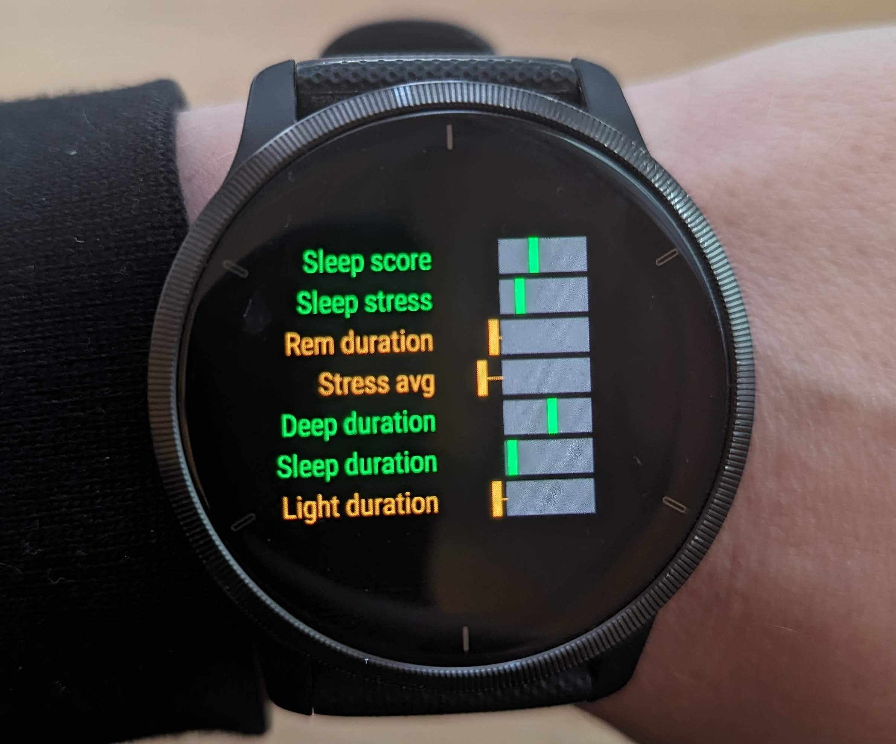

## RookLift

RookLift is an app for the Garmin watch that predicts your chess performance from your fitness and sleep metrics.

I used to use my chess performance as a proxy for how mentally able I was on any given day. Now I don't have to!

This app works by querying a model with current fitness, sleep metrics and chess score and getting back a probability that I will win my next game. If the probabilty is < .5, I'm "dumb", if it's > .5 I'm "smart". Code for the model is in [this repo](https://github.com/dmvaldman/Rooklift), and it's updated weekly in a CRON job.

## Screens

### Glance Screen
The glance screen shows the probability between [0,1] that I will win my next game.

### App Screen
The app screen breaks down the most significant fitness and sleep metrics (determined by the model) and compares them to a range of "good" values. The most significant metrics turn out the be stress (HRV) and REM sleep. Interestingly, strenuous activity (working out) and other sleep cycles (light, deep) are inversely correlated with chess ability.

